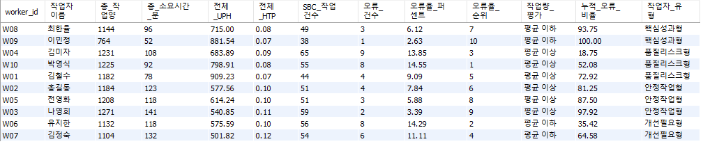
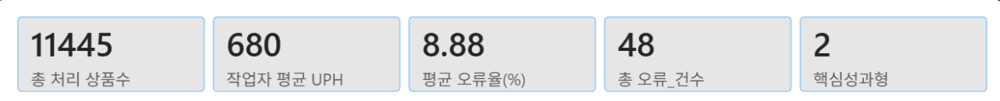
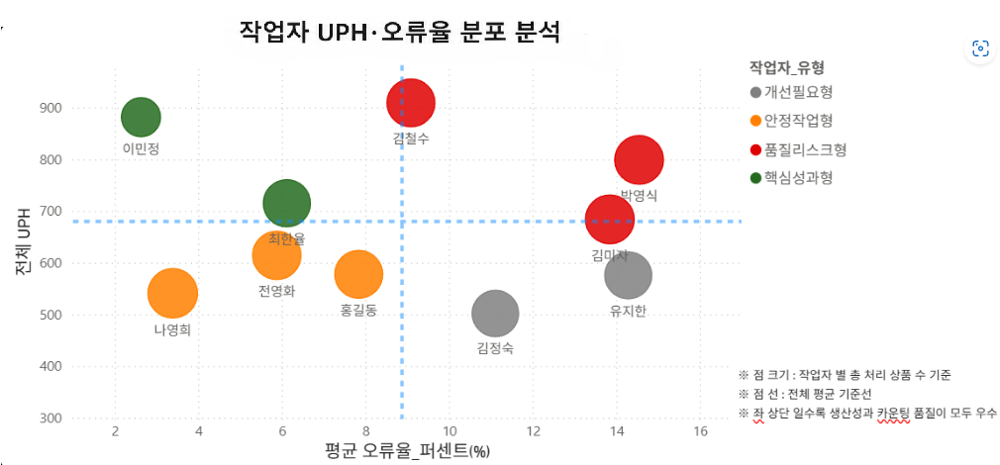

### 주요 분석 내용

## 1. 작업자별 KPI 분석 
: 단순 작업량이 높다고 반드시 높은 성과를 의미하지는 않는다.   
따라서, 본 분석에서는   

- 생산성  (UPH, 실제 처리 물량 )
- 정확도 (오류율)
- 시간당 처리량 ((HTP, 분당 처리량)
- 업무 기여도 (작업자 유형 분류)
  
를 종합적으로 분석하여 작업자의 성과를 다각도로 평가하고, 운영 효율성과 품질 측면의 개선 가능성을 확인하고자 하였다.

## 📈작업자별 생산성 및 오류율 통합분석
### 🛠️사용 SQL
- [SQL : 작업자별 UHP·오류율·HTP 산정 쿼리](./SQL/GITHUB_작업자생산성지표.sql)

---

### 📊 [작업자별 KPI 통합 지표]

> **💡 핵심 산정 기준 및 기획 의도**
> 
> 1. **생산성(UPH) 산정 기준**  
>    * 생산성(UPH)은 작업자가 실제 처리한 상품 수와 투입 시간을 기반으로 산정하였다. 단순 작업 건수가 아닌 실제 처리 물량을 반영하여 작업자의 생산성을 측정하고자 하였다.
>    * UPH = 총 처리 상품수 / 총 로케이션 수 (로케이션당 처리량)
>
> 2. **시간당 처리량(HTP) 산정 기준**
>     * 상품 1개를 처리하는 데 소요된 평균 시간을 의미한다. (값이 낮을수록 동일 시간 내 더 많은 물량을 처리할 수 있음)
>     * HTP = 총 처리 상품수 / 총 소요시간(분) (시간당 처리량)  
> 
> 4. **오류율 지표 산정 기준**
> * 작업자별 전체 SBC 조사 수행 건수를 기준으로, 최종 책임이 귀속된 오류 건수를 집계하였다.  
>  * 이를 통해 **작업자 개인의 순수 품질 리스크(Human Error)를 왜곡 없이 추출**하고자 하였다.
>  ( 오류율(%) = (작업자 귀속 오류 건수 ÷ 작업자 SBC 수행 건수) × 100 )  

※ UPH(생산성) → 속도  , 오류율 →정확' 를 기준으로 4개의 타입으로 분류   
※ HTP = 총 처리 상품수 / 총 소요시간(분)  

 

## 👥 작업자 유형 분류 및 관리 방안

작업자별 생산성(UPH)과 품질 리스크(오류율) 데이터를 매칭하여 총 4가지 군집으로 작업자 유형을 세분화하였습니다.

| 분류 Matrix | 오류율 낮음 (품질 우수) | 오류율 높음 (품질 리스크) |
| :---: | :--- | :--- |
| **UPH 높음** (속도 빠름) | **🟩 핵심성과형** • 최한율 (W08), 이민정 (W09) | **🟥 품질리스크형** • 김철수 (W01), 김미자 (W04), 박영식 (W10) |
| **UPH 낮음** (속도 신중) | **🟨 안정작업형** • 나영희 (W03), 전영화 (W05), 홍길동 (W02) | **⬛ 개선필요형** • 김정숙 (W07), 유지한 (W06) |

---

🟩 핵심성과형  :높은 생산성과 안정적인 정확도를 동시에 보유한 작업자
|---|  
- 업무표준 숙련도가 높아 안정적인 작업의 품질 유지 가능   
- 업무결과의 신뢰도 높음     
- 오류율 발생위험 높은 업무 배치가 가능한 포지션  
- 업무 효율 향상에 기여하는 핵심인력  

| 대상 대표작업자 |
| :--- |
| 최한율 (W08) / 이민정 (W09) |

---

🟨 안정작업형 : 생산성은 다소 낮지만 안정적인 품질을 유지하는 작업자
|---|  
- 낮은 오류율의 안정적인 작업 수행  
- 정확도(품질) 중심 업무수행 안정성 확인  
- 재고 신뢰도 확보 업무
  
| 대상 대표작업자 |
| :--- |
| 나영희 (W03) / 전영화 (W05) / 홍길동 (W02) |

---

🟥 품질리스크형 : 생산성과 오류율이 높아 품질 리스크가 존재하는작업자
|---|
- 재고의 신뢰도 저하 가능성 증가  
- 재검수(CC)발생으로 인한 업무 비효율과 업무 병목 가능성 존재  
- 정확도 중심 작업 기준 강화 필요  
- 작업 방식의 기준 및 검수 프로세스 재점검 필요  

| 대상 대표작업자 |
| :--- |
| 김철수 (W01) / 김미자 (W04) / 박영식 (W10) |

---

⬛ 개선필요형 :생산성과 정확도 모두 우선 관리가 필요한 작업자
|---|  
* 생산성, 효율 모두 개선을 위한 "우선 관리" 및 "교육 검토" 대상

**📌 향후 관리 대책 :**
* 업무기본교육 재진행
* 숙련자와의 페어기반으로 점진적 업무 개선 기반 모니터링 운영 추가 관리 필요성이 확인된다.

| 대상 대표작업자 |
| :--- |
| 김정숙 (W07) / 유지한 (W06) |

> [!NOTE]
> 본 분석은 단일 센터·10명·특정 기간이라는 데이터 한계로 인해 외부 기준값과의 절대 비교는 어렵다.
> 다만 센터 내 상대적 분포를 기준으로 보면, 품질리스크형 작업자의 평균 오류율은 센터 전체 평균(8.88%) 대비 약 1.5배 수준으로, 집중 관리가 필요한 그룹임을 확인할 수 있다. 해당 수치는 탐색적 분석 결과이며, 이후 데이터의 축적 기간을 늘리고 , 다른센터들의 데이터를 통한 비교 검증이 필요하다.

---
## 📊 [오류 집중도 분석]

> **💡 분석 배경**
> 작업자 유형 분석 결과, 일부 작업자는 높은 오류율과 함께 품질 리스크 가능성이 확인되었다.
> 이에 따라 오류가 특정 작업자에게 얼마나 집중되는지 객관적으로 확인하기 위해 **오류율 기준 Pareto 분석(80:20 법칙)** 을 추가로 진행하였다.

### 📈 Pareto Chart - 오류율 기준 파레토 차트 (80:20)

* **※ 주황색 바(Bar) :** 누적 오류 비율 80% 이내 주요 관리 대상
* **※ 회색 바(Bar) :** 80% 초과 일반 관찰 대상

---

### 🔍 데이터 기반 분석 결과 및 리스크 도출
* **80:20 집중도 현상 확인 :** Pareto 분석 결과, 상위 5명의 작업자가 전체 오류의 약 **73%** 를 차지하였고, 홍길동을 포함한 상위 6명 기준으로는 누적 오류율이 약 **81%** 에 도달하는 것을 확인하였다.
* **운영 효율 개선 방향성 :** 이를 통해 우수 작업자의 작업 패턴을 기준화하고, 오류 집중 작업자를 우선 관리하는 방식이 현장 운영 효율 개선에 효과적인 접근으로 판단된다.

🎯 **집중 교육 및 관리 대상자 선정 :**
* 차트 분석 결과에 의거하여 **김미자, 박영식, 유지한, 김정숙, 김철수, 홍길동**을 리스크 예방을 위한 **'우선 관리 대상'**으로 선정하는 것이 효율적으로 작업자 효율을 개선 하는 데 효과적이다.

---
> 세부 개선 방향 및 Action Plan은 [04. 종합 인사이트 및 개선방향](./04_종합_분석_및_개선방향.md) 참고

