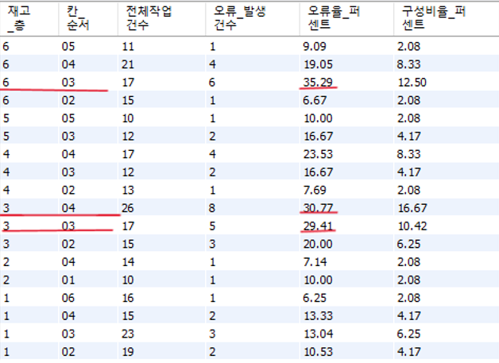
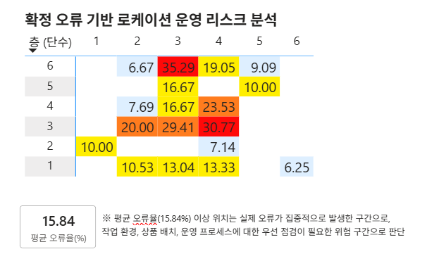

# 02-00. 로케이션 오류분석
: 작업자 개인의 숙련도에 따른 오류만이 아닌, 
업무의 환경적인 요인으로 인해 발생되는 오류의 가능성이 있다.
  
해당 분석에서는  
- 상단/하단 단수 
- 좌/우 특정 로케이션 
- 특정 위치 편중 현상
  
를 기준으로 오류발생과의 관련성 패턴을 분석하였으며,
단순 작업자 숙련도뿐 아니라 로케이션 구조 및 작업 환경 또한 재검수 발생에 영향을 줄 수 있기에
본 분석에서는 층·칸 구조별 불일치율 패턴을 통해 반복 재검수 위험 위치를 탐색하고 운영 환경 개선 가능성을 확인하고자 하였다.

✔️ 해당 분석은 파렛트존을 제외한 BIN위주의 분석을 진행하였다.

---

## 📈 환경적 운영 리스크 분석
### 사용 SQL
- [SQL : 층·칸별 로케이션 위치 오류율 산정 쿼리](./SQL/GITHUB_로케이션_오류.sql)

## ** [로케이션 '특정 위치(단수 +칸)' 오류] **

|컬럼|의미|
|---|---|
|전체작업건수| 해당 로케이션에서 수행된 재고조사 작업 횟수 기준|  
|오류율 퍼센트(%)| 작업 대비 오류 발생 비율 |
|구성비율(%)| 전체 오류 중 해당 위치가 차지하는 비중|

**※ 오류건수뿐 아니라 작업 대비 발생 오류율(오류율)을 함께 분석하여, 실제 위험도가 높은 위치를 식별하였다.** 
   

---

  

|구간|작업건수|오류건수|평균오류율|로케이션 수|
|---|---|---|---|---|
| 상단 (6~5층) |86건|16건|(평균) 16.13% | 165|
| 중단 (3~4층) |100건|23건|(평균) 21.35% | 191|
| 하단 (1~2층) |97건|10건|(평균) 10.05% | 176|  
  
## 📑 로케이션 기반 오류의 원인 가설

> 💡 **가설 수립**
> :"작업자 개인의 역량 이외, 로케이션의 구조와 상품 배치 등 환경적 요인에 초점을 맞추어 가설을 수립"

---

### ❶ 물리적 접근성 및 시야 제약 가설 `[고단 구간]`
* **현상 :** 상단 단수(5, 6층)의 신체적 제약 및 시야 사각지대 발생
* **원인 가설 :** 작업자가 표준 프로세스(실물 전수 검수)를 미준수하고, 육안에 의존한 **'수량 예측오류' 및 작업 편의주의적 판단**이 개입했을 가능성

---

### ❷ 높은 회전율 및 혼합 진열 간섭 가설 `[중단 구간]`
* **현상 :** 물동량이 가장 집중되는 3, 4층 구간의 최고 오류율 발생
* **원인 가설 :** 진열/집품 빈도가 높아 한 로케이션 내 혼합 진열로 오집이 발생할 비율이 높음. 유사 상품 인접 배치 시 시각적 혼선으로 인한 오집품 및 원복 오류가 발생했을 비율 또한 높음.
* **🎯 Next Step :** 가설 검증을 위해 **[[추가 분석 : 인접 로케이션 간 오류 연관성 분석]](./02-02_인접로케이션_교차_분석.md)** 을 진행

---

### ❸ 상품 중량/부피로 인한 실물 매몰 가설 `[저단 구간]`
* **현상 :** 하단(1, 2층)의 특정 칸(2~4번)의 오차 발생
* **원인 가설 :** 하단에 주로 진열되는 무겁고 부피가 큰 상품의 특성상, **실물이 뒤쪽으로 밀려 가려지는 상황이 발생**하여 조사 시 작업자가 수량을 누락했을 가능성
* **🎯 Next Step :** 가설 검증을 위해 **[[추가 분석 : 상품 카테고리 및 SKU별 오류 분석]](./02-01_카테고리별_오류_집중(Pareto).md)** 을 진행
