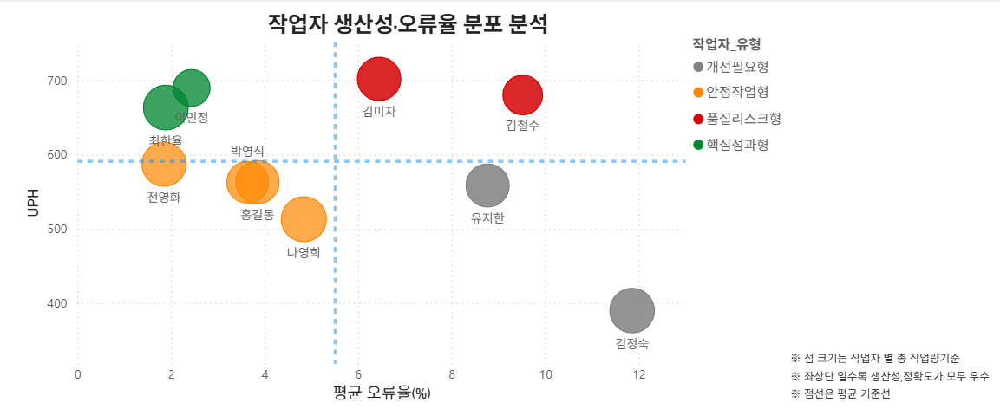
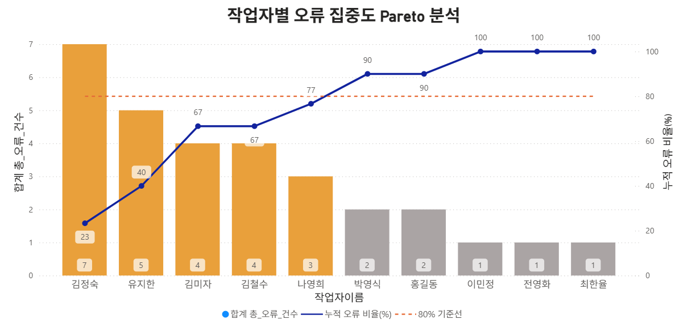

# 작업자 KPI 분석 및 운영 개선 인사이트 도출

## 프로젝트 개요
물류센터내 재고조사 는 단순히 작업의 양보다
결과적으로 보여지는 재고의 정확도와 신뢰도가 전체 운영의 품질에 큰 영향을 끼친다.

재고의 오류는,
- 반복 검수 (cc)증가로 인한 작업지연
- 업무의 병목
- 센터내 재고관리의 신뢰도 저하
로 이어질 수 있다.

따라서, 본 프로젝트에서는 현장의 SBC와 CC 결과 데이터를 유사하게 직접 생성하여, 
실제 현장에서 도출 할 수 있는 작업자별 KPI 분석과 작업 기여도, 오류의 발생패턴을
통합 분석하여 운영 리스크와 개선 포인트를 도출하고자 하다.

---

## 사용 기술
- SQL (MySQL)
- Python (Pandas)
- Power BI
- GitHub

---

## 데이터 구조

## 물류 ICQA 작업자 성과 분석 프로젝트
 본 데이터는 실제 센터내  재고조사 흐름을 기반으로 구성

작업자 정보 (workers.csv)

| 컬럼명 | 설명 |
|---|---|
| worker_id | 작업자 ID |
| name | 작업자 이름 |

SBC 작업 데이터 (sbc_raw.csv)

| 컬럼명 | 설명 |
|---|---|
| worker_id | 작업자 ID |
| location | 로케이션 |
| product_name | 상품명 |
| system_qty | 시스템 수량 |
| real_qty | 실물 수량 |
| qty_result | 판정 결과 |
| start_worktime | 시작 시간 |
| final_worktime | 종료 시간 |

CC 검수 데이터 (cc_raw.csv)

| 컬럼명 | 설명 |
|---|---|
| worker_id | 작업자 ID |
| location | 로케이션 |
| product_name | 상품명 |
| final_real_qty | 최종 실사 수량 |
| cc_status | 확정 상태 |
| 1차 작업시간 | 시작 시간 |
| 최종 작업시간 | 종료 시간 |

---

### 주요 분석 내용

## 1. 작업자별 KPI 분석
: 단순 작업량이 높다고 고 성과자로 판단할 수는 없다.  
 재고조사 업무시 발생하는 오류는
-  재검수 발생으로인한 업무 지연
-  다른 업무들의 병목
-  인력낭비
-  재고에대한 신뢰도 저하  
로 이어질 수 있기 때문에

해당 분석에서는 

- 생산성  (UHP)
- 정확도 (오류율)
- 작업 효율 (HTP)
- 업무 기여도
  
을 분석하였다.

## 📈작업자별 생산성 및 오류율 통합분석
# 사용 SQL
- ['KPI 생산성지표 `](./SQL/GITHUB_생산성지표.sql)
## ** [작업자별 KPI 통합 지표] **

  - SBC / CC 데이터를 기반으로 작업자별 UPH 및 오류율 집계하고 분류하여,
  작업자별 운영 특성과 품질 리스크를 함께 확인하고자 하였다.  

❗UPH(생산성) → 속도  , 오류율 →정확' 를 기준으로 4개의 타입으로 분류  

## 작업자 유형 분류
| --- |  오류율 낮음   | 오류율 높음 |
| --- | --- | --- |
|UPH 높음 | 🟩 핵심성과형 | 🟥 품질리스크형 |
|UPH 낮음 | 🟨 안정작업형 | ⬛ 개선필요형 |

🟩 핵심성과형  :높은 생산성과 안정적인 정확도를 동시에 보유한 작업자
|---|  
- 업무표준 숙련도가 높아 안정적인 작업의 품질 유지 가능   
- 업무결과의 신뢰도 높음  
- 오류율 발생위험 높은 업무 배치가 가능한 포지션  
- 업무 효율 향상에 기여하는 핵심인력  

**|대표작업자|
|---|
|최한율 (W08)|
|이민정 (W09)|**  

 

🟨 안정작업형 : 생산성은 다소 낮지만 안정적인 품질을 유지하는 작업자
|---|  
- 낮은 오류율의 안정적인 작업 수행  
- 정확도(품질) 중심 업무수행 안정성 확인  
- 재고 신뢰도 확보 업무   

**|대표작업자|
|---|
|나영희 (W03)|
|전영화 (W05)|
|박영식 (W10)|
|홍길동 (W02)|**  

 

🟥 품질리스크형 : 생산성과 오류율이 높아 품질 리스크가 존재하는작업자
|---|
- 재고의 신뢰도 저하 가능성 증가  
- 재검수(CC)발생으로 인한 업무 비효율과 업무 병목 가능성 존재  
- 정확도 중심 작업 기준 강화 필요  
- 작업 방식의 기준 및 검수 프로세스 재점검 필요  

**|대표작업자|
|---|
|김철수 (W01)|
|김미자 (W04)|**  

 

⬛ 개선필요형 :생산성과 정확도 모두 우선 관리가 필요한 작업자
|---|  
- 생산성, 효율 모두 개선을 위한 "우선 관리" 및 "교육 검토"대상  
  
따라서, 해당 분류의 작업자들은  
- 업무기본교육 재진행  
- 숙련자와의 페어기반으로 점진적 업무 개선 기반 모니터링 운영
추가 관리 필요성이 확인된다.

**|대표작업자|
|---|
|김정숙 (W07)|
|유지한 (W06)|**  

---
## ** [오류 집중도 분석] **
### Pareto Chart - 오류율기준 파레토 차트
  
※※ 생산성(UPH)은 로케이션 수가 아닌 실제 상품 처리수량 기준으로 산정하였다.
동일 로케이션이라도 상품 수량 차이에 따라 실제 작업 강도가 달라질 수 있기 때문이다.

## 📈운영 기여도 분석
 : 운영 기여도는 작업자의 처리량과 업무 집중도를 기반으로 현장 운영 의존도를 분석하기 위한 지표이다.  
 해당 인력의 부재시 업무의 딜레이 및 리스크 발생 위험성이 있다.
 따라서,
 - 누적 작업량
 - 누적 비중
 - 평균 대비 작업량
을 분석하여 핵심 작업자를 확인했다.

# 사용 SQL
- ['작업자 업무기여도`](SQL/GITHUB_생산성지표.sql)

---
---
# 원인 분석

## 주요 인사이트

- 특정 작업자의 오류율이 평균보다 높게 나타남
- 특정 로케이션에서 반복적인 재고 오류 발생
- 작업량 증가 시 오류율 상승 경향 발견
- 검수 프로세스 개선 필요성 확인

---

## 개선 방안

- 고오류 작업자 재교육
- 로케이션 관리 체계 개선
- 검수 프로세스 자동화
- 오류 발생 패턴 모니터링 시스템 구축

---

## 프로젝트 결과

본 프로젝트를 통해 물류 현장의 작업 오류 패턴을 정량적으로 분석하고  
실질적인 개선 방향을 도출할 수 있었습니다.

---

## 작성자
Portfolio Project by [Your Name]
